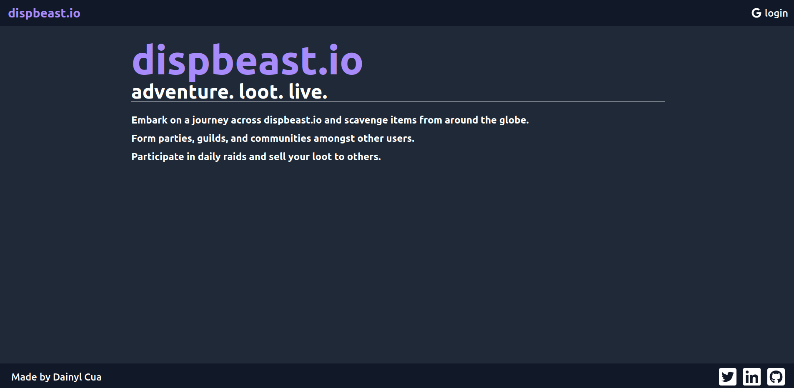
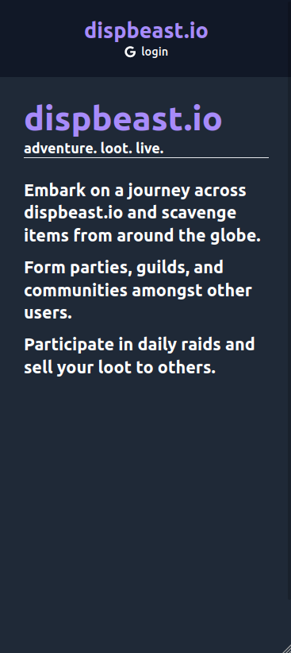
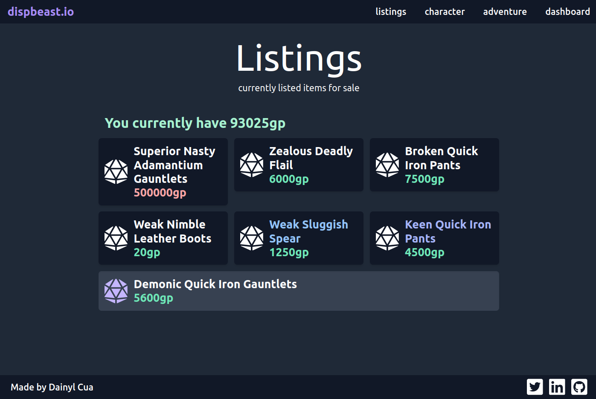
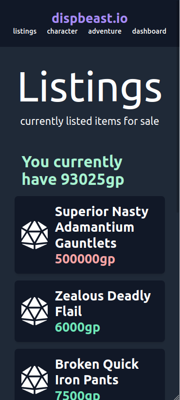
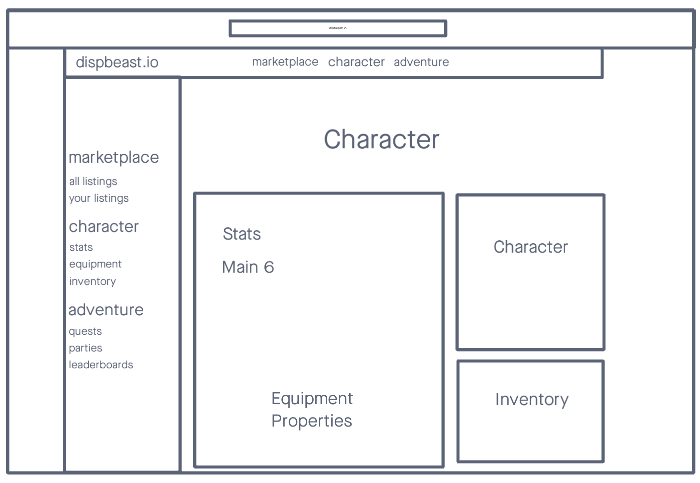

# dispbeast.io
*An eCommerce-game website inspired by D&D built with the MERN stack.*

## Purpose

dispbeast.io (named after the [Displacer Beast](https://forgottenrealms.fandom.com/wiki/Displacer_beast)) is an eCommerce-game website inspired by D&D. This can be considered the final module before I integrate my other two projects, [DungeonSheet](https://github.com/dainylcua/dungeon-sheet) and [5eTale](https://github.com/dainylcua/5eTale), into an extensive web application.

## Technologies Used

* HTML5, CSS3, JavaScript
* MongoDB
* Express
* React.js
* Node.js
* Heroku
* Netlify
* Tailwind CSS

*Developed on Ubuntu 20.04.3 LTS*

## Screenshots

_Note: Website layout is still a work in progress._

## Getting Started

Click [here](https://dispbeastio.netlify.app/) to open a live version of the app.

Click [here](https://trello.com/b/KdxYXip8/dispbeastio-progress) to see my progress on the app on Trello.

## Unsolved Issues

* UseEffect() memory leaks

## Planned Features

* Improved UI/UX (animations, transitions, better responsive layouts, better feedback, consistent layouts and components)
* Comprehensive information display (listing end dates, equipment modifiers, damage calculation, armor class)
* Additional and improved models (more references, guilds, parties, quests)
* Improved listings
* Combat implementation
* ...and more!
